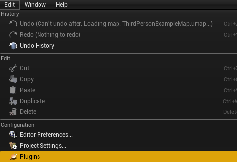
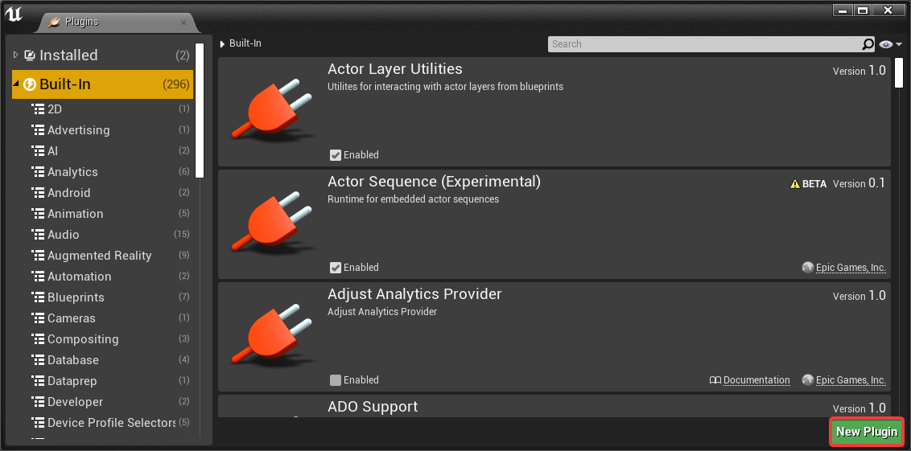
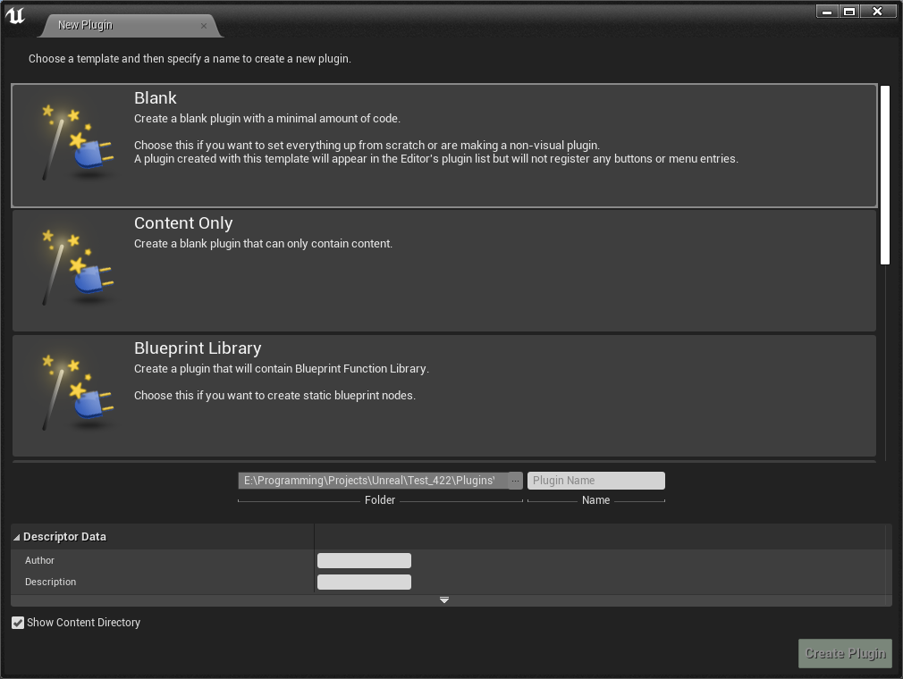
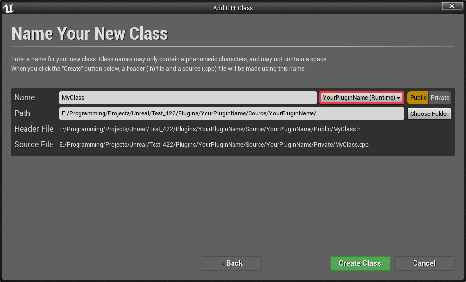
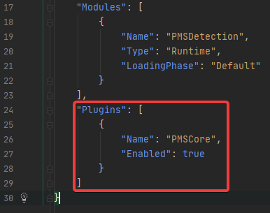

# Plugins
## Setting up a new Plugin
1. open the Plugins Window  
   

2. click on create new plugin  
   

3. select a template for the plugin and fill in the name of the plugin, the author and a description  
    

4. To create a c++ class from within Unreal you have to select the correct project/ plugin. It will be located at the path: ./ProjectName/Plugins/PluginName/Source/Public/YourFile.h and ./ProjectName/Plugins/PluginName/Source/Public/YourFile.cpp  
   

## Managing Plugin Dependency
We will need plugins to depend on each other (mostly on PMSCore). For this we will have to change some settings in the plugin. These changes are only necessary in the plugin that depends on another one.

For the following example there are 2 plugins. PMSCore and PMSDetection. PMSDetection depends on PMSCore.

1. Change the uplugin file of PMSDetection. After the "Modules" declaration we will have to add plugins on which this plugin depends on.  
    

2. Add the required dependencies in the Build.cs file.  
    